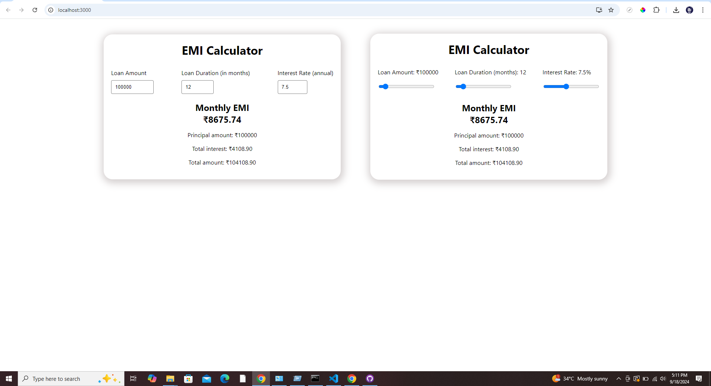

# EMI Calculator

This is a simple React application for calculating EMI (Equated Monthly Installment) based on loan amount, loan duration, and interest rate.

## Features

- Calculate EMI based on loan parameters
- Responsive and easy to use UI

## Technologies Used

- React
- JavaScript (ES6+)
- CSS (optional for styling)

Demo for Reslut 

